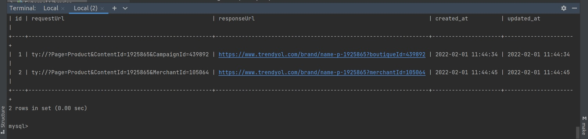

# Trendyol Deep Link Converter
Simple api project for deeplink challenge
Also, you can find postman collection in postman folder for each request which are in case pdf.

## Installation & Run
### 1. With Docker
```bash
$ docker-compose build
$ docker-compose up
```
### 2. Manually
```bash
$ go build main.go
$ ./main
```
Notice: If you run project manually you can't log the requests in database.
Database run in same docker container with api.
### Run Unit Tests

```bash
$ go test -v ./...

# Show coverage

$ go test -v ./... -cover
```

## API

#### /urltodeep
* `POST` : Convert url to deeplink

#### /deeptourl
* `POST` : Convert deeplink to url

## Accessing To Logs
While your docker container is up you need to do this steps:
```bash
$ docker-compose exec db /bin/bash
$ mysql -p
$ password: "root"
$ show databases;
$ use my_scheme
$ show tables;
$ select * from logs;
```
Logs table look like:



## Want To Do
* Improve the using of database connector in project. (Now for every request, dbBuilder connect to database and try to 
create log table then insert the log event.)
* Add edge cases for unit tests.
* Improve the coverage of unit tests.
* Add routes, services and dbBuilder unit tests with mocking.
